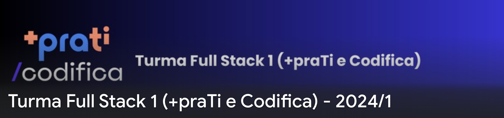

# [+praTI](https://www.maisprati.com.br/) e [Codifica](https://www.codificaedu.com.br/) - Curso Full Stack Jr. (2024)

Bem-vindo ao meu repositório onde irei armazenar as atividades do curso Full Stack Jr., uma parceria entre [+praTI](https://www.maisprati.com.br/) e [Codifica](https://www.codificaedu.com.br/). Este curso aborda uma formação completa em desenvolvimento de software, focado em preparar profissionais para os desafios do mercado de tecnologia, com um equilíbrio entre teoria e prática.

## Estrutura do Repositório

#### Subpastas e Conteúdos:

- `/Módulo 1 - Introdução a Lógica de Programação`
  - Exercícios práticos.
  - Lista de exercícios práticos.
- `/assets`
  - `/img`

### Acesso aos Arquivos

Navegue pelas pastas acima para acessar os arquivos e materiais relacionados ao curso.

## Sobre o Curso

O curso é composto por 9 módulos, cada um abordando uma área fundamental para o desenvolvimento de software:

- Introdução à Lógica de Programação
- Git e Github
- Fundamentos do Frontend
- Frontend com React
- Backend com Java
- Banco de Dados com MySQL
- APIs e APIs REST com Spring Boot
- CI/CD
- Módulos Extras

### Objetivo

O objetivo é formar desenvolvedores de software prontos para o mercado de trabalho, capacitados para desenvolver, testar e manter sistemas complexos, e preparados para inovações contínuas na área de tecnologia.

### Metodologia

- Aulas teóricas e práticas em módulos organizados.
- Projetos práticos ao final de cada módulo para aplicação do conhecimento.
- Desenvolvimento de um projeto final abrangente, simulando um ambiente real de trabalho.

## Conteúdo

O curso oferece uma jornada completa no desenvolvimento de software, com foco em:

- Construção de lógica de programação sólida.
- Uso efetivo do Git e Github.
- Desenvolvimento frontend com React.
- Implementação de backend com Java e Spring Boot.
- Gerenciamento de bancos de dados MySQL.
- Construção de APIs REST.
- Implementação de CI/CD para automação de processos.
- Exploração de tópicos extras para ampliar o conhecimento.
